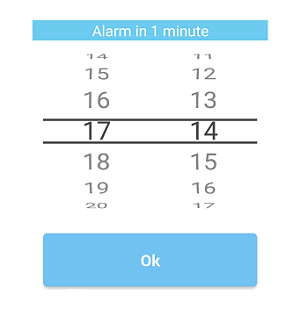
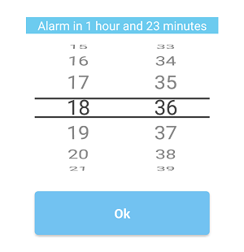

# React-Native-Wheel-Time-Picker for Android

Simple and functional Wheel Time Picker for React Native.

## Installation 

1. Install following modules:

- https://github.com/react-native-community/react-native-modal
- https://github.com/ElekenAgency/ReactNativeWheelPicker 

  You can use any other modal library. It's just the matter of some adjustments.

2. Paste provided	`timepicker` catalog to your `src` folder and follow Usage instructions.

## Usage
```js
import React, { Component } from "react";
import { Text, View } from "react-native";

import TimePickerMenu from "../timepicker/TimePickerMenu";

class YourClass extends Component {
  constructor(props) {
    super(props);
    this.state = {
     pickerVisible: false,
     selectedHours: "09",
     selectedMinutes: "00",
    };
  }

  closePicker(selectedHours, selectedMinutes) {
    this.setState({
      pickerVisible: false,
      selectedHours: selectedHours,
      selectedMinutes: selectedMinutes
    });
  }
  
  render() {
    return (
      <View style={styles.container}>
        <View style={styles.buttonContainer}>
          // Displays selected time in format HH:mm and opens TimePicker
          <TouchableOpacity onPress={() => this.setState({ pickerVisible: true })}>
            <Text style={styles.instructions}>{(this.state.selectedHours) + ":" + (this.state.selectedMinutes)}</Text>
          </TouchableOpacity>
        </View>
        <TimePickerMenu
          onClose={(selectedHours, selectedMinutes) => this.closePicker(selectedHours, selectedMinutes)}
          visible={this.state.pickerVisible}
        />
      </View>
    );
  }
}
```

## Screenshots


 
 

